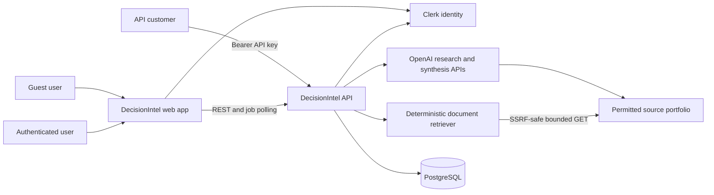
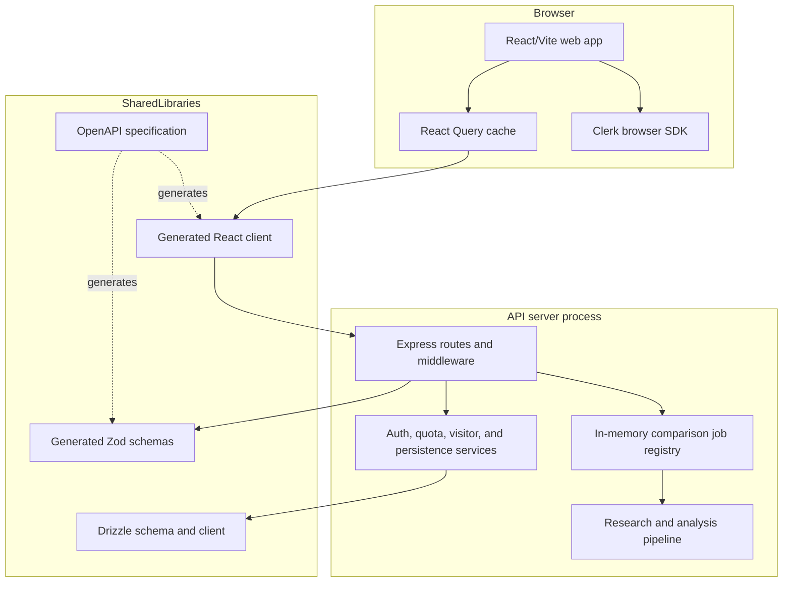
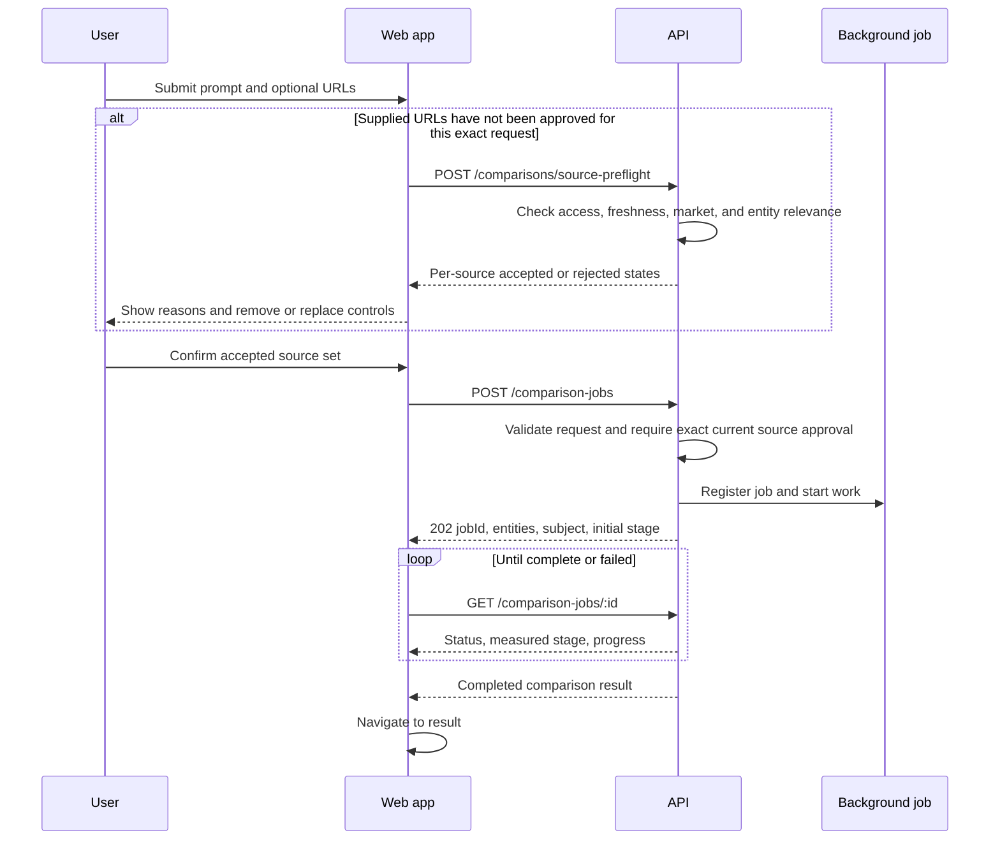
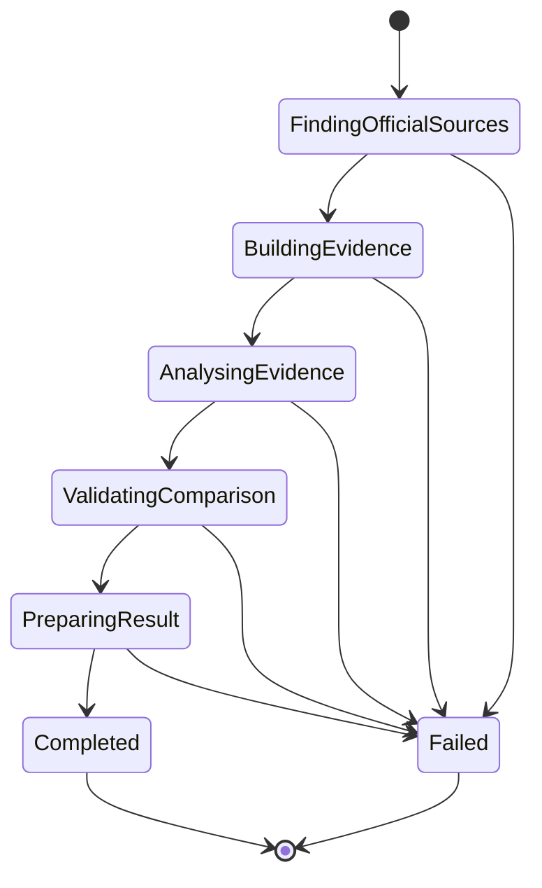
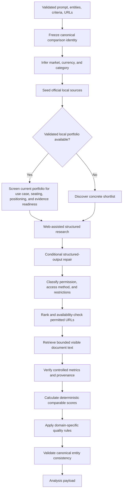
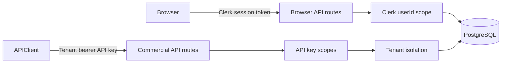
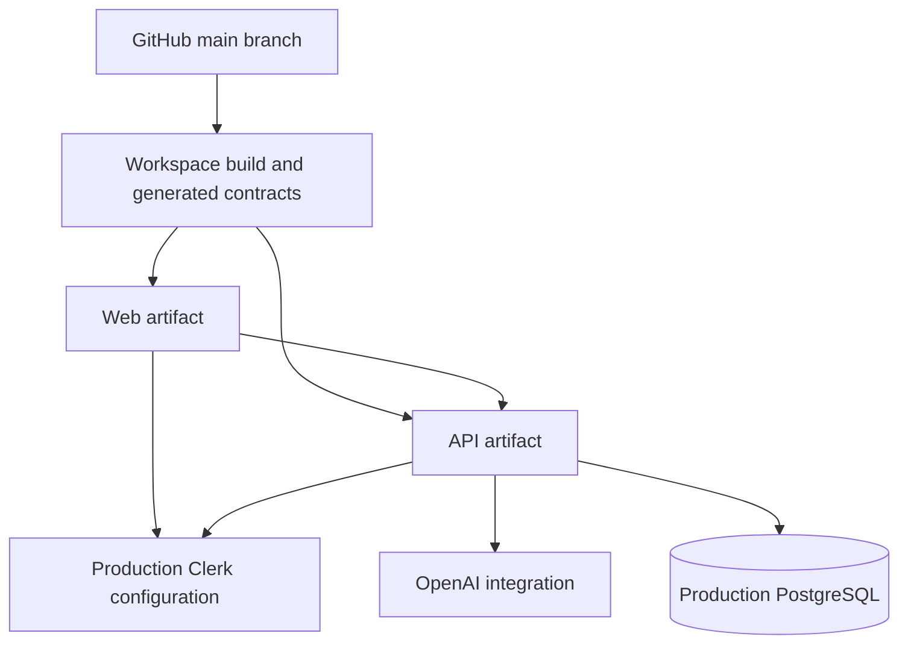

# DecisionIntel Architecture and Design

**Document status:** As-built reference  
**Last updated:** 21 September 2026  
**System:** DecisionIntel vendor and product comparison platform

## 1. Purpose

DecisionIntel turns a natural-language decision request into an evidence-backed comparison. A user names products, vendors, providers, or an objective; the system identifies the comparison set, researches current evidence, validates the result, calculates weighted scores, and produces a report.

This document describes the current implementation, its runtime boundaries, major data flows, security model, design decisions, and known limitations. It is intended for engineering, product, operations, and future architecture work.

## 2. Architecture Goals

The implementation is designed around these goals:

1. **Ground recommendations in permitted evidence.** Material claims and scores must be traceable to directly validated customer-supplied, structured, licensed, official, syndicated, or permission-aware public sources.
2. **Preserve comparison identity.** The entities accepted from the request remain the canonical ranked set throughout research, scoring, tables, and recommendations.
3. **Keep long AI work off the browser request.** Browser comparison requests use submit-and-poll jobs rather than one long HTTP connection.
4. **Report measured progress.** Progress comes from backend pipeline boundaries, not elapsed-time estimates.
5. **Separate verified facts from assumptions.** Missing or inaccessible evidence is represented as unavailable or low-confidence rather than invented.
6. **Use contract-first API development.** OpenAPI is the source of truth for generated runtime schemas and frontend clients.
7. **Enforce ownership at every boundary.** Authenticated data is scoped by Clerk user identity; commercial API data is scoped by tenant and API key.
8. **Keep scoring reproducible.** Weighted evidence contributions are normalized and reconciled with persisted totals.
9. **Bound launch-market claims.** MVP research is limited to India, Australia, the United States, and the United Kingdom rather than implying reliable worldwide local coverage.
10. **Target a sub-two-minute interactive result.** Verified portfolio paths avoid redundant AI stages and expose a 120-second service objective while preserving evidence gates.
11. **Treat access restrictions as evidence gaps.** Robots policy, authentication, paywalls, publisher controls, and rate limits stop acquisition rather than trigger a workaround.
12. **Release only decision-grade conclusions.** Every report exposes evidence-quality metrics and a `PASS`, `PASS_WITH_WARNINGS`, or `FAIL` decision; failed gates suppress definitive ranking.
13. **Expose historical uncertainty.** Partial time series remain visible with explicit gaps and forecast suppression rather than being hidden or interpolated.

## 3. System Context



### External dependencies

| Dependency | Responsibility |
|---|---|
| Clerk | Browser authentication, session validation, and user identity |
| OpenAI | Intent extraction, web-assisted product research, structured analysis, and repair passes |
| Permitted source portfolio | Customer-supplied evidence, official sources, regulators, standards bodies, licensed data, authorised feeds, and permission-aware public evidence |
| PostgreSQL | Persistent comparisons, evidence, users, tenants, API keys, usage, idempotency records, and visitor sessions |
| Replit workflows and artifact routing | Development runtime, path-based preview routing, and deployment execution |

## 4. Repository and Runtime Topology

The repository is a pnpm workspace with separate web and API artifacts plus shared libraries.

```text
artifacts/
  api-server/          Express API and background comparison work
  vendor-compare/      React/Vite DecisionIntel web application
  mockup-sandbox/      Isolated design and component preview artifact
lib/
  api-spec/            OpenAPI source and Orval configuration
  api-client-react/    Generated React Query client and custom fetch layer
  api-zod/             Generated Zod request/response schemas
  db/                  Drizzle schema, database client, and migrations
docs/                  Engineering and operational reference documents
```

### Runtime containers



## 5. Frontend Design

### 5.1 Technology and responsibilities

The web application uses React, Vite, TypeScript, React Query, wouter, Clerk, and generated API hooks. Its entry point is `artifacts/vendor-compare/src/main.tsx`; the main product surface is currently consolidated in `artifacts/vendor-compare/src/App.tsx`.

The frontend is responsible for:

- Guest and authenticated navigation.
- Prompt and optional source URL collection.
- Per-source pre-research validation, rejection explanations, and remove or replace controls.
- Asynchronous comparison job submission and polling.
- Rendering measured backend progress.
- Dashboard, history, and comparison detail views.
- PDF and JSON export.
- Release-quality gate rendering and remediation guidance.
- Historical data-quality, missing-period, and forecast-suppression states.
- Clerk sign-in and sign-up flows.
- Session-scoped guest result and draft handling.

### 5.2 State model

| State type | Mechanism | Examples |
|---|---|---|
| Server state | React Query | Dashboard summary, history, comparison details |
| Authentication | Clerk React SDK | Session state and bearer token acquisition |
| Job progress | Local React state updated by polling | Current backend stage, identified entities, subject |
| Form state | Local React state | Prompt, optional URLs, validation feedback |
| Short-lived browser state | `sessionStorage` | Draft prompts and guest comparison handoff |

The API client obtains a fresh Clerk bearer token through the custom fetch layer. Query retries exclude unauthorized responses, and server-state refresh behavior is configured centrally.

### 5.3 Comparison submission flow



The browser does not calculate progress from elapsed time. It displays:

- Request understood.
- Identified canonical entities.
- Identified subject.
- The current backend research stage.
- Completed stages inferred only from forward backend state transitions.

The accepted-job contract also returns `targetCompletionSeconds` and each poll
returns server-measured `elapsedMs`. The current target is 120 seconds. This is
an operational service objective, not an estimated progress percentage, hard
deadline, or permission to bypass evidence validation.

Supplied-source preflight is intentionally separate from prompt parsing and research execution. The browser submits the exact prompt, selected market, and ordered URL set for validation. Rejected pages stay in the composer with a specific state and explanation until removed or replaced. A successful preflight does not itself start research; the user submits again after reviewing the accepted set.

## 6. API Design

### 6.1 Middleware and route boundaries

The Express application is assembled in `artifacts/api-server/src/app.ts`. It provides:

- Structured request logging.
- CORS and credential handling.
- JSON and form parsing.
- Clerk middleware.
- Cache prevention for API responses.
- API route composition.
- Production Clerk frontend proxy support.

Primary route groups include:

| Route group | Purpose |
|---|---|
| Health | Runtime health checks |
| Guest comparison routes | Rate-limited prompt parsing, job creation, polling, and guest results |
| Authenticated comparison routes | Dashboard, history, source preflight, persistent comparisons, jobs, and deletion |
| Commercial `/v1` routes | Tenant-scoped API-key access, quota, usage, and idempotent comparison requests |
| Management routes | Tenant and commercial account operations |

### 6.2 Contract-first development

`lib/api-spec/openapi.yaml` is the API contract source of truth. Orval generates:

- React Query hooks and TypeScript models in `lib/api-client-react`.
- Zod schemas and TypeScript models in `lib/api-zod`.

Route handlers validate outgoing and incoming structures with generated schemas. After changing OpenAPI, code generation must run before application code uses the new contract.

## 7. Asynchronous Comparison Job Architecture

### 7.1 Job lifecycle

Browser comparison jobs are maintained in an in-process map keyed by UUID. Every job includes:

- Owner identifier.
- `processing`, `complete`, or `failed` status.
- Current measured stage.
- Identified entities and subject.
- Result or stable failure information.
- Creation timestamp.

Jobs are owner-bound. An authenticated user cannot poll another user’s job, and guest ownership is tied to the server-derived guest request owner. Expired jobs are pruned after the configured retention window.

When URLs are supplied, every guest and authenticated job or synchronous comparison endpoint requires an unexpired approval for the exact owner, prompt, market, and ordered URL set. Approval is recorded only when every source is accepted. Changing any request component, retaining a rejected source, or allowing the approval to expire fails closed before a job is registered. This API boundary prevents stale clients and direct callers from bypassing browser validation.

### 7.2 State machine



Stages have the following meaning:

| Stage | Measured boundary |
|---|---|
| `finding_official_sources` | Request parsing has completed and deterministic official-source discovery begins |
| `building_evidence` | Web-assisted research is collecting and structuring evidence |
| `analysing_evidence` | Returned evidence is normalized, scored, and reconciled |
| `validating_comparison` | Canonical entity and comparison consistency checks run |
| `preparing_result` | The validated result is assembled and, when authenticated, persisted |
| `completed` | A response-safe result is available |

No percentage is exposed because the number of web searches, repair passes, URL checks, and normalization operations varies by request.

### 7.3 Failure model

Jobs expose stable high-level failure codes:

- `research_failed`
- `validation_failed`
- `insufficient_quantitative_evidence`

`insufficient_quantitative_evidence` means the request and options were understood, but current relevant documents did not provide enough like-for-like verified metrics to create a reliable ranking. A neutral 50/100 score is the midpoint used for an unsupported criterion so missing evidence cannot favour or penalise an option; it is not proof that the options perform equally. Recovery guidance asks the user to provide exact current product or evidence URLs on the next attempt. Irrelevant and outdated resources remain excluded even when the user supplies them.

## 8. Research and Analysis Pipeline

The main pipeline is implemented in `artifacts/api-server/src/lib/analysis.ts`.



### 8.1 Intent and comparison identity

The parser extracts:

- Canonical entities.
- Subject or segment.
- Decision type and use case.
- Criteria.
- Market context.

Deterministic validation prevents model output from silently redefining the ranked comparison set. Objective phrases and categories cannot be treated as vendor names. When an open-ended objective requires product discovery, the system selects concrete products before full analysis.

### 8.2 Portfolio-first product selection

When a request names manufacturers but not exact products, the system evaluates
the current local model families before ranking. Minimum comparability is a
guardrail rather than the whole decision method:

1. Candidates must serve the same broad use case.
2. Seating and market positioning must reasonably overlap.
3. Specialist, halo, premium, and flagship products are excluded from a broad
   mainstream request unless explicitly requested.
4. Viable pairings are then assessed holistically against the user’s criteria,
   ownership value, technology, capability, and evidence quality.
5. A ranked pair must expose enough exact official local evidence to support
   comparable deterministic metrics.

For verified portfolios, server-owned current-model and evidence-readiness
metadata is used directly. This avoids redundant discovery, adjudication, and
repair calls and is the primary latency optimization for the 120-second target.
Generic manufacturer combinations continue through bounded web portfolio
discovery and deterministic validation.

The report preserves a visible `Model selection rationale —` disclosure and
credible excluded pairings with trade-offs. Those protected disclosures are
reattached after final synthesis so narrative generation cannot remove them.
Evidence readiness is described as a decision constraint, never as proof that a
selected model is universally the manufacturer’s best product.

### 8.3 Evidence and source-portfolio policy

The pipeline prioritizes:

1. Customer-supplied documents and URLs with retained lineage.
2. Structured, licensed, official, regulatory, standards, audited, and first-party sources.
3. Authorised APIs, feeds, and publisher syndication.
4. Permission-aware public sources with identifiable methodology.

Market-specific terms must not be replaced with another country’s pricing or product conditions. Non-official fallback evidence is freshness-limited to the trailing year. Search results may identify candidate sources, but claims must come from directly validated permitted documents. Search snippets, anonymous posts, affiliate pages, unsupported AI summaries, irrelevant pages, and outdated resources are not authoritative evidence. User-provided URLs are first-class candidates with retained lineage, but are not automatically trusted evidence.

### 8.4 Source validation

Collected URLs are:

- Deduplicated.
- Ranked by authority, market relevance, product specificity, and freshness.
- Reserved so every named option has a product-specific retrieval candidate and the corpus retains a shared regulator, standards, or market-context source when available.
- Filtered for the requested market.
- Checked with absolute wall-clock deadlines and bounded redirects.
- Checked against publisher robots policy before availability probing or content retrieval.
- Requested with an identifiable DecisionIntel research user agent.
- Rejected when they resolve to private or loopback destinations.
- Classified with `ALLOWED`, `LICENSED`, `CUSTOMER_SUPPLIED`, `ACCESS_UNAVAILABLE`, or `PROHIBITED` access status and an acquisition method.
- Excluded from evidence and ranking when robots-disallowed, authenticated, paywalled, rate-limited, prohibited, or otherwise unavailable.
- Retrieved with a text/HTML/JSON MIME allowlist and a 512 KiB body limit.
- Revalidated after every redirect and before returning a cached redirect target.
- Stored only in a bounded, expiring in-memory document cache keyed by canonical URL. Redirect origins and their safe final target share one cached document identity, while the final destination is revalidated before reuse.

User-supplied URLs pass through a pre-research classification stage before entering this portfolio:

- `accepted` when the page is reachable, readable, current, market-compatible, and relevant to at least one canonical compared entity.
- `inaccessible` when permission, network safety, timeout, redirect stability, authentication, rate limiting, or readable-content checks fail.
- `stale` when URL or retrieved document metadata identifies material outside the current comparison window.
- `wrong_market` when explicit host, currency, or market signals conflict with the selected market.
- `unrelated` when retrieved visible text does not name a canonical compared entity or a distinctive entity alias.

Entity matching preserves meaningful short brands and acronyms while excluding generic descriptors such as “model,” “service,” “platform,” or “cloud” as standalone relevance evidence. Preflight batches and document retrieval are concurrency-bounded, and both guest and authenticated callers are rate-limited.

Accepted supplied pages retain `CUSTOMER_SUPPLIED` acquisition lineage and a `primaryContext` marker in persisted report source metadata. That marker is visible in completed reports and PDF evidence tables. It indicates that the user selected the page as decision context; it does not bypass claim-level evidence verification.

Before DNS, availability probing, or retrieval, the runtime consults the persistent domain-and-path source registry. Exact path decisions take precedence; only an explicit root scope is domain-wide. A current prohibited or access-unavailable decision stops network activity. A current allowed, licensed, or customer-supplied decision can authorise the configured collection method until its review date; expired decisions are checked again. Automated observations use short review windows and may be stored alongside reviewed policy, but never overwrite reviewed status, ownership, terms, allowed uses, or restrictions.

The registry records domain, source type, access status and method, robots result, licence or terms notes, policy owner, review dates, allowed uses, and restrictions. Each report source retains an immutable snapshot of the governing registry decision so a later policy update does not rewrite the report's audit history. Legacy reports and clients remain valid because registry metadata is optional.

HTML is structurally parsed. Script, style, template, navigation, footer, form, iframe, hidden, and `aria-hidden` content is removed before normalization. Normalized visible text is hashed with SHA-256. Source availability alone does not make a claim scoreable: a quantitative claim must also match retrieved visible text and carry its document hash and exact text offsets.

Restrictions are data-availability conditions, not obstacles. The system never bypasses CAPTCHAs, paywalls, authentication, robots.txt, IP blocks, API limits, anti-bot controls, or publisher restrictions. An unavailable source remains in the report only as an auditable access record and cannot support a score. Recovery guidance asks for an authorised API, feed, licensed source, or customer-supplied document.

### 8.5 Scoring model

Evidence rows carry normalized scores, criterion weights, confidence, support direction, weighted contribution, document provenance, a server-derived metric subject, and a server-derived comparison basis. Model-proposed metrics are candidates only.

The server owns the controlled metric registry, allowed units, and scoring direction. Verification requires:

- One exact adjacent numeric value and allowed unit.
- The full compared product identity near the matched claim, including numeric or one-character model identifiers.
- A registered metric label near the matched value.
- A metric-specific basis, such as WLTP/ARAI/EPA/NEDC range standard, usable/gross/nominal battery capacity, AC/DC charging, charge window, loan LVR/borrower/repayment type, market and period, population and period, or warranty coverage.
- A retrieved-document normalization marker, SHA-256 hash, and valid source text range.

Deterministic scoring groups values only when metric key, unit, direction, and complete basis match across every shortlisted option. Unknown metrics and incomplete bases fail closed. Raw retrieved source prose and web-search output are not sent to the final decision synthesizer. Its corpus contains only validated typed records with an exact quote, metric identity, unit, basis, retrieval date, canonical source URL, document hash, text offsets, support direction, normalized score, and weighted contribution.

Missing or non-comparable evidence receives 50/100, the neutral midpoint. This prevents missing evidence from creating an advantage or penalty and does not assert equal real-world performance. A ranked recommendation requires deterministic comparable metrics covering at least 50% of the canonical weighted model and actual score separation; otherwise the job fails with `insufficient_quantitative_evidence`.

Normalization distinguishes:

- Direct percentages where higher is better.
- Inverse percentages where lower is better, such as complaint, defect, failure, fee, incident, downtime, and interest-rate measures.
- Qualitative evidence.
- Analyst judgment.
- Unverified evidence.

Persisted contributions must reconcile with reported score totals. Recommendation text is reconciled with the scorecard so tied scores and narrative winners do not contradict each other.

### 8.6 Release quality gate

The report workspace calculates and exports a machine-readable release assessment:

- `PASS` when evidence coverage, freshness, comparability, access governance, and concentration meet the decision threshold.
- `PASS_WITH_WARNINGS` when the report remains useful but material uncertainty or concentration requires explicit caution.
- `FAIL` when a prohibited source affects scoring or a definitive recommendation lacks minimum verified coverage.

The gate reports citation coverage, freshness coverage, comparable-cell coverage, unknown rate, source concentration, historical-series comparability, reasons, and remediation. A failed gate returns an evidence-limited brief: browser and PDF outputs suppress winner labels, winner styling, score emphasis, and closest-alternative language.

### 8.7 Historical observations and forecasting

Historical analysis stores yearly observations with valid time, observed time, metric key, unit, methodology, event type, evidence URL, and an explicit gap reason where applicable. The UI displays partial histories instead of hiding them, lists missing periods, and does not interpolate absent observations.

Comparable history requires the same metric definition, unit, geography, population, cadence, methodology, and exact valid-time window across options. A standalone complete series is still non-comparable when its cross-option signature differs. Material events and methodology changes are distinct from observations. Forecasts remain suppressed unless a sufficiently complete comparable series supports a stated method, horizon, assumptions, interval, and confidence.

### 8.8 Domain-specific controls

The generic comparison pipeline has focused extensions for cases requiring additional evidence structure, including:

- Electric vehicle pricing and specification matrices.
- Indian Battery-as-a-Service comparisons.
- Provider-level credit card discovery.
- Home-loan product and five-year trend research.
- Strategic provider roles and enterprise migration considerations.

These controls add quality requirements without allowing a domain-specific repair pass to replace the canonical entity set.

Battery-as-a-Service and other usage-priced comparisons resolve exact current products and can verify entry price, usage cost per kilometre, ground clearance, range, charging, and warranty. The composer accepts optional annual distance and ownership period as bounded numeric contract fields. When both are present, the server deterministically calculates one scenario row from verified entry-price and per-kilometre evidence, records the total distance and formula, and identifies the lowest verified total. The report explicitly excludes financing, charging or electricity, insurance, tax and registration, maintenance, and termination or transfer charges. When either assumption or either verified cost component is missing, no total is invented. The report instead compares documented rates and leaves total cost conditional.

## 9. Persistence and Data Ownership

### 9.1 Main data areas

The PostgreSQL schema in `lib/db/src/schema` covers:

- Users.
- Comparisons and detailed report structures.
- Normalized comparison evidence.
- Visitor sessions.
- Tenants.
- Tenant API keys.
- Usage events and billing periods.
- Idempotency records.
- Commercial account and retirement/audit data.
- Publisher permission and source-use decisions with review dates.

### 9.2 Authenticated browser persistence

Authenticated comparisons are persisted atomically after validation. Every list, detail, and delete query is constrained by Clerk `userId`. The browser dashboard currently presents recent history within the product’s configured time window.

Guest comparisons are returned to the browser but are not added to authenticated history.

### 9.3 Commercial API persistence

Commercial API operations are tenant-scoped. The metered comparison path coordinates:

- API-key scope checks.
- Tenant entitlement and quota.
- Idempotency-key ownership.
- Request-hash replay and conflict detection.
- Transaction locking.
- Comparison and evidence persistence.
- Usage event creation.

The comparison result and its billable usage record are committed atomically.

## 10. Authentication, Authorization, and Tenant Isolation



### Browser users

- Clerk validates the session.
- The server derives `userId`; the client does not choose its owner.
- Queries include the user ownership predicate.
- Guest routes use server-side rate limiting and owner checks.

### Commercial customers

- Bearer API keys are stored and validated through the tenant API-key service.
- Every key has explicit scopes.
- Tenant identity is derived from the key.
- Quota and usage are enforced server-side.
- Idempotency protects duplicate metered execution.

## 11. Security and Privacy Design

Current controls include:

- Generated Zod validation at API boundaries.
- Rejection of unsafe markup, SQL-shaped input, and instruction-injection patterns.
- HTTP/HTTPS URL validation.
- A maximum comparison-set size.
- Canonical entity validation.
- Clerk session validation.
- Tenant API-key scopes and isolation.
- Guest request rate limiting.
- Private-network and loopback blocking during source checks.
- DNS, redirect, request, and batch wall-clock deadlines.
- Bounded document size, retrieval concurrency, and cache capacity.
- Structural visible-text extraction before claim verification.
- Server-owned metric identity, unit, direction, subject, and basis validation.
- Exact document-hash and source-offset provenance for scoreable metrics.
- Robots-policy enforcement before automated collection.
- Explicit source access status, acquisition method, check time, and restriction records.
- Exclusion of restricted and prohibited sources from evidence and ranking.
- Removal of raw web prose from final LLM synthesis.
- API `no-store` responses and disabled ETags.
- Query-string removal from structured request logs.
- Pseudonymized visitor analytics with inactivity-based retention.
- Stable public error codes instead of internal stack traces.

### Trust boundaries

User prompts, supplied URLs, model output, and web content are all untrusted. Prompts and web pages are treated as data rather than instructions. Model output is parsed, normalized, source-checked, and validated before persistence.

Publisher permission is a separate trust boundary from network reachability. A publicly resolvable URL is not automatically collectable or scoreable.

Registry reuse is fail-closed: current prohibitions stop collection before any network request, expired entries do not grant access, and transient reachability failures receive a short recheck window rather than becoming permanent publisher policy.

## 12. Observability and Operations

The API uses structured logging for requests and background-job failures. Health endpoints support workflow checks. The application is run as separate Replit workflows for the API, web artifact, and component-preview artifact.

Operational verification includes:

- API and frontend TypeScript checks.
- API unit and integration tests.
- Intent parsing evaluations.
- Citation transport checks across supported Node runtimes.
- Build checks for workspace libraries and artifacts.
- Browser preview and console-log inspection.

Runtime services bind to the Replit-provided port and use artifact-aware base paths. Browser code calls proxied artifact routes rather than hard-coded localhost addresses.

## 13. Deployment Model



Deployment configuration must provide the production database, Clerk configuration, session secret, and AI integration through environment secrets. Development preview domains are not production URLs and must not be embedded as canonical production addresses.

## 14. Key Design Decisions

### 14.1 Submit-and-poll instead of long browser requests

**Decision:** Browser research uses a short submission request and short polling requests.

**Reason:** Web research and structured repairs can exceed proxy idle windows. Polling is recoverable and gives the UI a stable status surface.

### 14.2 Measured stages instead of estimated percentages

**Decision:** The API exposes named pipeline stages and parsed entities, not a percentage.

**Reason:** Research duration and work volume are not predictable from elapsed time. A timer percentage would misrepresent actual completion.

### 14.3 Canonical identity before research

**Decision:** Freeze the ordered comparison set before downstream analysis.

**Reason:** Research models can otherwise merge brands, substitute products, or allow recommendation text to redefine the options.

### 14.4 Evidence-aware neutral handling

**Decision:** Missing evidence receives neutral, low-confidence treatment.

**Reason:** Absence of evidence must not become a positive or negative score by accident.

### 14.5 Generated API boundary

**Decision:** OpenAPI generates both client hooks and server schemas.

**Reason:** Shared generated contracts reduce drift between React callers, route handlers, and runtime validation.

### 14.6 Separate browser and commercial execution semantics

**Decision:** Browser jobs optimize for interactive progress; commercial requests add tenant quota, billing, and idempotency controls.

**Reason:** The two channels have different ownership, retry, and metering requirements.

### 14.7 Deterministic retrieval before scoring

**Decision:** AI research output may propose sources and metrics, but only server-retrieved document text can verify a quantitative metric for scoring.

**Reason:** URL presence and model citations do not prove that a source contains the claimed value, that the value belongs to the compared product, or that values share a comparable basis.

### 14.8 Fail closed on metric semantics

**Decision:** Metric identity, units, direction, subject, and basis are server-owned. Unknown or incomplete metrics remain neutral and cannot create a ranking.

**Reason:** Inferring scoring semantics from model prose can reward adverse outcomes, compare unlike products or periods, and manufacture confidence from missing evidence.

### 14.9 Verified portfolio fast paths

**Decision:** A server-validated current portfolio may bypass redundant
model-based discovery, adjudication, and comparability correction.

**Reason:** Repeating those stages adds provider latency and structured-output
failure modes without improving a selection already bounded by current-model,
comparability, and evidence-readiness rules.

### 14.10 Permission before acquisition

**Decision:** Determine robots and access permission before availability probing or content retrieval. Restricted sources remain audit records but cannot support ranking.

**Reason:** Discoverability is not permission. Preserving a restricted citation as evidence can indirectly bypass publisher controls and create non-reproducible conclusions.

### 14.11 Visible historical gaps

**Decision:** Render partial historical series with explicit gaps and suppress unsupported forecasts.

**Reason:** Hiding partial evidence conceals decision-relevant uncertainty, while interpolation creates false continuity.

### 14.12 Machine-readable release quality

**Decision:** Compute a report-level quality state with transparent metrics, reasons, and remediation, and include it in evidence exports.

**Reason:** A weighted score alone does not disclose whether evidence coverage, freshness, comparability, source concentration, and acquisition permissions support a definitive decision.

### 14.13 Exact supplied-source approval boundary

**Decision:** Validate supplied URLs before research and authorize execution only for the exact owner, prompt, market, and ordered URL set that passed preflight.

**Reason:** Browser-only validation can be bypassed by direct or stale clients. Exact short-lived server approval prevents rejected, altered, or expired source sets from entering research or being labelled as primary context.

## 15. Current Limitations and Risks

### 15.1 Volatile browser job storage

Browser comparison jobs are stored in API process memory. A process restart removes active and recently completed job state. Multi-instance deployment would also require shared job coordination.

**Recommended direction:** Move jobs to durable storage or a queue with leases, retries, stage history, and result retention.

### 15.2 No browser-job resume or idempotency key

A browser retry creates a new job. The commercial path has stronger idempotency semantics than the browser path.

**Recommended direction:** Add a client-generated submission key and server-side request hash for safe retry and resume.

### 15.3 Closed quantitative metric registry

Quantitative scoring intentionally supports only registered metrics with explicit unit, direction, subject, and basis rules. A novel domain metric remains neutral until its semantics are added server-side.

**Recommended direction:** Expand the registry through reviewed metric definitions and adversarial tests. Do not infer unknown metric direction or comparability from model output.

### 15.4 Text-document retrieval scope

Deterministic retrieval currently accepts HTML/XHTML, plain text, and JSON. PDF and other binary document formats are not used for score verification.

**Recommended direction:** Add a bounded, sandboxed PDF extraction path with equivalent SSRF, size, timeout, structural, provenance, and injection controls before allowing PDF metrics to affect scores.

### 15.5 Large frontend module

The main UI is concentrated in `App.tsx`, which increases coupling between routing, views, exports, and job state.

**Recommended direction:** Split by route and domain while preserving the generated API boundary and current user journeys.

### 15.6 Legacy synchronous comparison routes

Synchronous browser comparison endpoints coexist with the preferred asynchronous job endpoints.

**Recommended direction:** Confirm external dependencies, deprecate legacy browser usage, and retain only intentionally supported synchronous commercial behavior.

### 15.7 Error-log sensitivity

Background failure logs include error messages and stacks. Although request query strings are removed from access logs, exceptions may still contain source or provider context.

**Recommended direction:** Apply structured error redaction and retention policies appropriate to production data sensitivity.

## 16. Change Guidelines

When changing this architecture:

1. Update `lib/api-spec/openapi.yaml` first for API contract changes.
2. Regenerate the React client and Zod schemas.
3. Keep browser research asynchronous.
4. Emit progress only at real backend boundaries.
5. Preserve the canonical ordered entity set.
6. Validate every material score against source-linked evidence.
7. Keep user and tenant ownership predicates in database queries.
8. Make schema changes additive unless data deletion is explicitly reviewed.
9. Verify API tests, type checks, generated clients, and affected browser flows.
10. Update this document when a runtime boundary, data owner, major pipeline stage, or security assumption changes.
11. Keep the 120-second target explicit in the OpenAPI job contract; optimize by removing redundant work, never by weakening evidence gates.
12. Preserve portfolio-selection rationale and excluded alternatives across final synthesis and persistence.
13. Check publisher permission before network collection and never preserve restricted sources as ranking evidence.
14. Export a machine-readable release-quality result and suppress definitive rankings on failure.
15. Show historical gaps explicitly; never interpolate missing periods or forecast from incomparable observations.
16. Follow the repository-wide rules in `docs/rules.md`.

## 17. Primary Code References

| Area | Primary location |
|---|---|
| Web application | `artifacts/vendor-compare/src/App.tsx` |
| Web entry point | `artifacts/vendor-compare/src/main.tsx` |
| API application | `artifacts/api-server/src/app.ts` |
| Comparison routes and jobs | `artifacts/api-server/src/routes/comparisons/index.ts` |
| Research and analysis pipeline | `artifacts/api-server/src/lib/analysis.ts` |
| Commercial API | `artifacts/api-server/src/routes/commercial.ts` |
| API contract | `lib/api-spec/openapi.yaml` |
| Generated React API client | `lib/api-client-react/src` |
| Generated server schemas | `lib/api-zod/src/generated` |
| Database schema | `lib/db/src/schema` |
| Workspace operating guidance | `replit.md` |
| Engineering and product rules | `docs/rules.md` |
